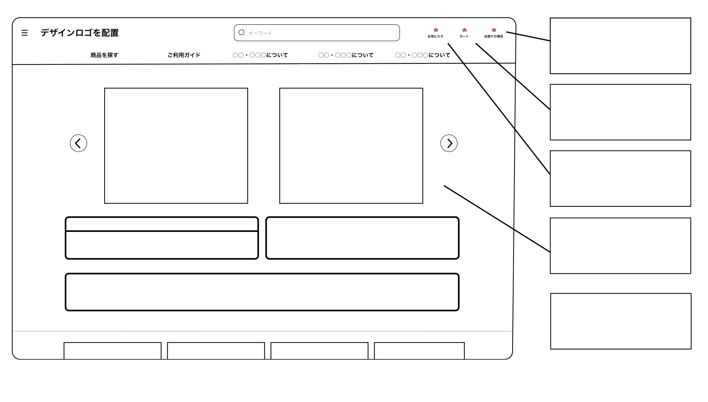
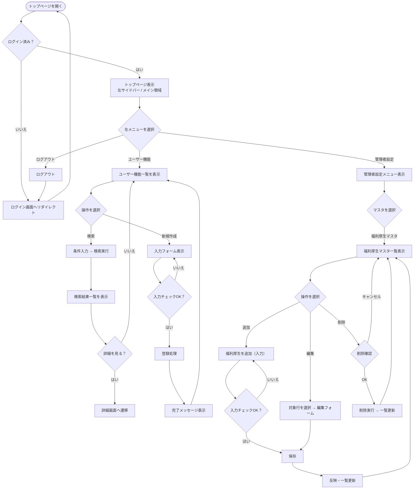

# トップページ

## 画面レイアウト

| 画面イメージ |
|:---:|
|  |

## 概要
○○○○○が○○○○○○のため、○○○○○を行う画面。

## 操作フロー

## 画面構成

### 1. 左側サイドバーメニュー

#### メニュー構成
○○○○○○○を表示：

**ユーザー機能**

## 操作仕様
- ...

## データ要件
- ...

## 関連ドメインモデル
- ...

## 福利厚生マスタ設定画面 - 関連ドメインモデルのER図

- ...

... こんな感じでまとめていきます

